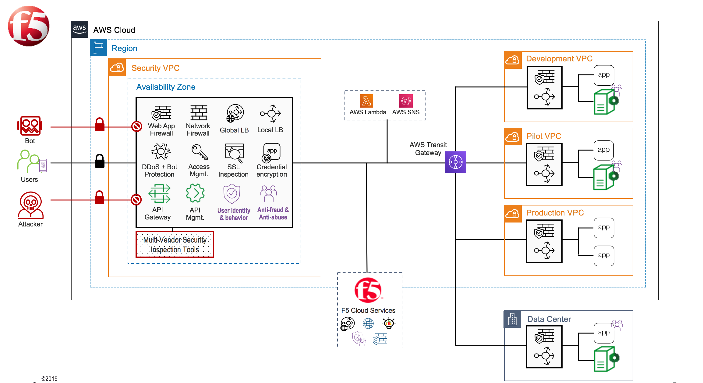
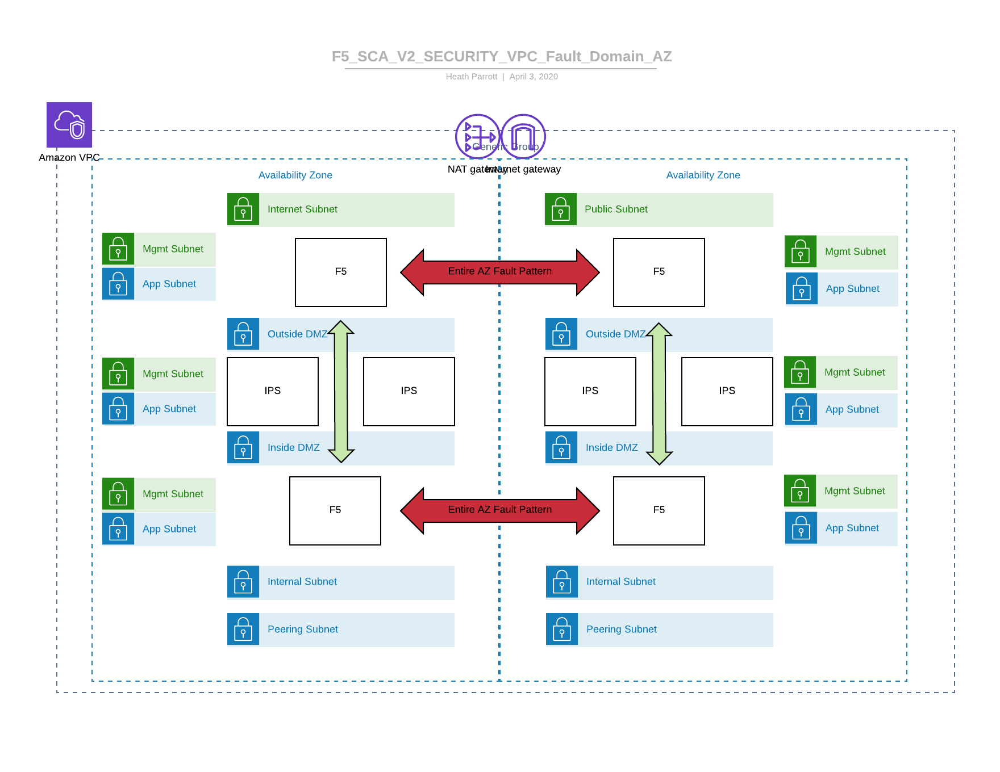

# F5 Terraform AWS Secure Cloud Architecture (SCA)

## Contents

- [CHANGELOG](CHANGELOG.md)
- [What is SCA](#what-is-sca)
- [Prerequisites](#prerequisites)
- [Requirements Mapping](#requirements-mapping)
- [Deploying Custom Configuration to the BIG-IP VE](#deploying-custom-configuration-to-the-big-ip-ve)
- [Post-Deployment Configuration](#post-deployment-configuration)
- [Creating Virtual Servers on the BIG-IP VE](#creating-virtual-servers-on-the-big-ip-ve)
- [Support Guide](#support-guide)
- [Contributing](#contributing)

## What is the Secure Cloud Architecture 

The Secure Cloud Architecture (SCA) is a location & cloud agnostic flexible and repeatable conceptual deployment pattern that can adapt for all customers challenges in the cloud. The SCA pattern is based on several core tenets around business outcomes and design principles:

- Nearly all organizations will be multicloud (Public AWS/Azure/GCP/OCI/Alibaba/VMC/Other, Private, Hybrid) from an Operational and Technology Stack perspective
- Enterprise wide architectural decisions need to be made to reduce operational complexity while allowing the onboarding of high value aspects of any given cloud environment. 
- Patterns are required to increase agility and they must be reusable, transferable, automated and iterative. 
- Operations and Security teams need to enable development and business units, while ensuring Governance and Efficiency 
- Time to Value across any environment must be reduced
- Support cost optimizations and flexible consumption models (Capex/Opex/Elastic)
- Reduce risk by minimizing bifurcation of tools and process wherever possible by leveraging reusable tools and processes
- Focus on stability
- A repeatable data path allowing focus on compliance, operational efficiency and delivery of application assets to customers, employees and partners.
- Leverage APIs and Automation 
- Extensible - if/when a given Cloud Service Provider introduces options to simplify the architecture they can be incorporated

Conceptually a Secure Cloud Architecture looks like:

Depending on the cloud provider, fault domains, scale models, IPS systems, or other specific requirements there will be variation in how you can finalize the architecture of your deployment.  Examples of different fault domains and patterns

- Availability Zone Fault Domain

 - Benefits - simpler operations, conceptually easier data path.
 - Drawbacks - Failovers need to leverage a device layer to device layer monitor, Force Offline is used over Standby, and intrusive

- Device Level Fault Domain

 - Benefits - failover is less intrusive
 - Drawbacks - use of Alien IP ranges to move tunnel endpoints and tunnels creates complexity, two layers of data path to support and troubleshoot

## AWS Specific Features

The SCA leverages the following in the example architecture

- VPC
- Route Tables
- TransitGateway
- VPC Endpoints for EC2 and S3
- S3 Buckets
- EC2 Instances
- Routing via ENI
- IAM Roles
- CloudWatch

The following AWS Technologies or Deployment considerations are compatible (not conclusive and will change over time)

- VPC Peering (requires the use of SNAT)
- VPN interconnecting VPCs
- Ingress Routing
- Deployment of F5 products into another account (recipient account must click subscribe, deploying account must be able to create resources in destination account)
- Global Accelerator
- VPCE for STS

## Prerequisites

- [AWS Subscription](https://console.aws.amazon.com) - with sufficient permissions.
- [Terraform](https://learn.hashicorp.com/terraform/getting-started/install.html)
- Understanding of the AWS SDN components and operations
- Understanding of F5 products in AWS - https://clouddocs.f5.com/cloud/public/v1/aws_index.html and our GitHub repository - https://github.com/F5Networks/f5-aws-cloudformation
- Understanding of F5 BIG-IP modules, virtual servers

## Meeting Compliance Requirments

The SCA is the base cloud topology allowing you to build to meet compliance across industry and verticals.  The [AWS Shared Responsibility Model](https://aws.amazon.com/compliance/shared-responsibility-model/) is clear. **AWS is responsible for the scurity of the cloud** and **you are responsible for your security and compliance in the cloud**. F5 technoligies enable you to focus on the **in the cloud** dimension. 

To support the various needs of different compliance requirments end users will need to apply specific configuraitons to F5 and AWS resources that are deployed.  The correct process to do that is both a technology question and and orgnaizational specific operational question. The F5 SCA is a base for your to build upon to meet those needs.

## Requirments Mapping - Financial Services

| Requirement | Infrastructure Impact | How F5 Meets this Requirment  |
|:---:|:---:|:---:|
| Implement safeguards to prevent data tampering and ensure its integrity (SOX, GLBA, USA Patriot Act, Basel III, HIPAA, GDPR, FIPS)|Encrypt all sensitive data and secure private keys|F5 LTM can terminate and re-encrypt any data passing through a BIGIP.  It can also integrate with an external HSM to ensure private keys are secured and meet FIPS standards.|
|Monitor and record access to sensitive data (SOX, OCC, PCI, HIPAA, PIPEDA) | Log access activity on all systems and send it to a central system for monitoring |Being in the application flow, F5 BIGIP generates extensive analytics data.  Telemetry Streaming in F5's Automation Toolchain can declaratively create a logging policy and configure streaming destinations for the analytics data. |
|Ensure the security and confidentiality of customer data (PCI, GLBA, HIPAA, PIPA, GDPR) | Block sensitive data from being written to logs, and use layer 4-7 firewalls and encryption to ensure data is secure | Advanced WAF running on F5 BIGIP will obfuscate information such as credit card numbers, social security numbers, and other sensitive customer data, so it cannot be captured in application or logging traffic. |
|Protect against any reasonably anticipated threats or hazards to the security and integrity of data (GLBA, PCI, HIPAA, GDPR) | Use firewalls and remain up-to-date on all mitigations for newly identified threats and vulnerabilities | F5 AFM provides layer 4 firewall capabilities, while Advanced WAF provides up to layer 7.  Patches, signature file updates, and iRules can be used in tandem to stay ahead of threats. |
|Prevent unauthorized access to or use of sensitive data (GLBA, PCI, FACTA, HIPAA, PIPEDA) | Implement role-based access control | F5 APM allows polices to be implemented for integration with any AAA system, including establishing granular role-based access to applications and systems. |
|Multifactor authentication (FFIEC, PSD2) | Require at least two forms of authentication to access systems and data | F5 APM policies can be created to work with existing MFA solutions or to create on by integrating with multiple systems. |
|Encrypt transmission of cardholder data across open, public networks and all online transaction processing (PCI, GLBA, FFIEC, HIPAA, PIPEDA, GDPR) | If data is decrypted on a system, re-encrypt is before sending it to the next hop | F5 LTM can terminate and re-encrypt any data passing through a BIGIP. |
|Protect all systems against malware and regularly update anti-virus software or programs (PCI) | Inspect all data entering and leaving systems looking for signatures of malware and viruses | F5 Advanced WAF protects against attacks and malware using a frequently updated signature file which can be seamlessly refreshed on the F5 systems. |
| Identify and authenticate access to system components (PCI, GDPR) | Enforce a zero-trust model where all system clients are authenticated and only have the minimum required permissions and access | F5 BIGIP has native role-based authentication and integrates with many AAA protocols |
| Identify and respond to red flags indicating possible identity theft as they occur (FACTA, HIPAA) | Implement layer 7 WAF policies to detect and prevent intrusion attempt | F5 Advanced WAF recognizes and blocks red flags to help prevent the theft of identity information.  F5 Websafe helps protect clients from transmitting confidential data through compromised browsers. |
| Secure access by establishing zones according to the risk profile and criticality of assets contained within the zones (PCI, FFIEC) | Implement a multi-tier DMZ infrastructure separating the presentation servers from application and database servers | F5 AFM and Advanced WAF provide the security necessary to create separate security zones.  The F5 Automation Toolchain can be used to automatically build a secure DMZ in a cloud environment. |
| Ability to restore the availability and access to data (HIPAA, GDPR) | Build the infrastructure with redundancy and high availability to automatically recover from any single failure | F5 LTM on BIGIPs built in active/standby pairs or in clusters provide high availability within a specific location.  F5 DNS on BIGIPs intelligently provides DNS based multi-site redundancy. |

## Requirements Mapping - DoD / DISA

| Category | Title | Description | Mapping | Controls |
|:---:|:---:|:---|:---|:---:|
| Security | Traffic Segregation | - The Security Stack shall maintain virtual separation of all management, user, and data traffic. - Components shall provide logically separate network interfaces for access from the management network infrastructure that is logically separate from production. - The Security Stack shall provide secure connectivity to Application management systems that is logically separate from application traffic. - Components shall provide for management traffic segmentation from user and data plane traffic. | LTM / AFM / CORE | SCCA 2.1.2.1, 2.3.2.6, 2.3.2.9, 2.2.3.3 |
| Security | Traffic Encryption | The Security Stack shall allow the use of encryption for segmentation of management traffic. | LTM / Core | SCCA 2.1.2.2 |
| Security | Reverse Proxy | The Security Stack shall provide a reverse proxy capability to handle access requests from client systems. | LTM / Core | SCCA 2.1.2.3 |
| Security | Traffic Filtering | The Security Stack shall provide a capability to inspect and filter application layer conversations based on a predefined set of rules (including HTTP) to identify and block malicious content. | AFM / ASM / PS | SCCA 2.1.2.4 |
| Security | Block Unauthorized | The Security Stack shall provide a capability that can distinguish and block unauthorized application layer traffic. | ASM / AFM| SCCA 2.1.2.5 |
| Security | Traffic Monitor | The Security Stack shall provide a capability that monitors network and system activities to detect and report malicious activities for traffic entering and exiting Application virtual private networks/enclaves. | ASM / AFM / PS| SCCA 2.1.2.6 |
| Security | Block Malicious | The Security Stack shall provide a capability that monitors network and system activities to stop or block detected malicious activity. | ASM / AFM / PS | SCCA 2.1.2.7|
| Security | East / West Inspection | The Security Stack shall inspect and filter traffic traversing between application virtual private networks/enclaves.| AFM | SCCA 2.1.2.8 |
| Security | Break and Inspect Traffic | The Security Stack shall perform break and inspection of SSL/TLS communication traffic supporting single and dual authentication for traffic destined to systems hosted within the Cloud Service Provider.| LTM | SCCA 2.1.2.9 |
| Security | Management Access & Control | The Security Stack shall provide an interface to conduct ports, protocols, and service management activities in order to provide control for operators. | Core / AFM / ASM| 2.1.2.10|
| Security | Logging | The Security Stack shall provide a monitoring capability that captures log files and event data for cybersecurity analysis. | Core | SCCA 2.1.2.11|
| Security | SIEM Integration | The Security Stack shall provide or feed security information and event data to an allocated archiving system for common collection, storage, and access to event logs by privileged users. | Core | SCCA 2.1.2.12|
| Security | FIPS 140-2 | The Security Stack shall provide a FIPS-140-2 compliant encryption key management system for storage of generated and assigned server private encryption key credentials for access and use by the Web Application Firewall (WAF) in the execution of SSL/TLS break and inspection of encrypted communication sessions. | Core | SCCA 2.1.2.13|
| Security | Prevent Session Hijacking | The Security Stack shall provide the capability to detect and identify application session hijacking. | APM / ASM | SCCA 2.1.2.14|
| Security | Provide DMZ | The Security Stack shall provide a DMZ Extension to support Internet Facing Applications. | Core | SCCA 2.1.2.15 |
| Security | Full Packet Capture | The Security Stack shall provide full packet capture or cloud service equivalent capability for recording and interpreting traversing communications. | Core | SCCA 2.1.2.16 |
| Security | Provide Flow Metrics | The Security Stack shall provide network packet flow metrics and statistics for all traversing communications. | Core / AVR | SCCA 2.1.2.17|
| Security | North-South Traffic Inspection | The Security Stack shall provide for the inspection of traffic entering and exiting each Application virtual private network. | AFM | SCCA 2.1.2.18 |
| Security | Management Access | The Security Stack hall allow Priviledged User access to Application management interfaces. | APM / PUA | SCCA 2.2.3.2|
| Scale | Rapid Scale| The Security Stack shall be designed to rapidly scale virtual elements up and down in capacity to achieve negotiated (between components provider and Mission Owner) SLA objectives while minimizing metered billing costs. | Core / AWS | SCCA 2.6.2.1 |
| Scale | Scaling Increments | The Security Stack shall support scalability in increments of 1 Gigabit/second throughput at all points within the design without costly modification. | Core / AWS| SCCA 2.6.2.2 |
| Performance | Throughput | The Security Stack shall start with 1 Gigabit/second throughput and have ability to scale up to 10G.| Core | SCCA 2.4.1.2 |
| Performance | Redundancy | The Security Stack shall meet backbone availability of 99.5%. | Core / AWS | SCCA 2.4.1.5 |
| Performance | Latency | The Security Stack processing latency shall be no greater than 35 milliseconds. | Core / AWS | SCCA 2.4.2.1 |
| Performance | QoS| The Security Stack shall support IP packet forwarding in accordance with tagged QOS prioritization| LTM | SCCA 2.4.2.5 |
| Full Packet Capture | SIEM Integration | The Security Stack shall support integration with SIEM systems to effect data search and retrieval, such as the capability to pull select timeframes of captured data. | Core | SCCA 2.3.5.1 |

## Deploying Custom Configuration to the BIG-IP VE

| Failure Domain | Deployment Pattern | How F5 Meets this Requirment  |

## Post-Deployment Configuration

The SCA provides a base topology to build to regulated environments and you will need to harden the deployment to your required busienss or legal requirments. 

### Creating Virtual Servers on the BIG-IP VE

Creating virtual servers is a multistep process that can be accomplished via APIs or direct user interaction.  A virtual server consists of the following components

1. Virtual Server IP and configuration
2. SDN Assigned secondary IP that = the Virtual Server IP
3. Elastic IP (Public IP) that is mapped to a virtual server(s)

If a user is deploying an inter-AZ HA model (this template does) a public IP will be mapped/remapped to two different virtual servers since an Availability Zone is also a subnet boundary. For more information on this process please refer to F5's Cloud Failover Extension documentation found here - https://clouddocs.f5.com/products/extensions/f5-cloud-failover/latest/userguide/aws.html 

F5 recommends that customers leverage AS3 for configuration and management of virtual servers (Step 1 Above). AS 3 will incorporate features faster than imperative API tools such as Ansible or Terraform modules and allows users to move to an as-code model.  For more information on AS 3 please see https://clouddocs.f5.com/products/extensions/f5-appsvcs-extension/latest/.  AS3 can be imbedded into CFT calls, used with Terraform, used with Ansible or pushed via tools such as Postman or CURL. 

For the other configuration steps there are many automations tools available and your organization should work with the ones that allow you to be the most efficient overall.  The workflow that is accomplished via Terraform in this repository could also be accomplished via those tools. 

## Working with MultiAccount Environments 

In cloud migrations it is not uncommon for organizations to leverage multi-account enivonrments, such as AWS LandingZone/Control Tower. As an example you may have developer accounts, networking accounts, security accounts, master payer etc.  In this scenario we need to think about the environment in business and technical terms. 

__Business__
- Payer Accounts - this is outside of F5's perview ans is an AWS related item.
- End User License Agreements - the EULA must be accpted by the account in which the image is deployed. For example if you want to deploy instances into an account named APP_DEV an admin in the account will need to "subscribe" to the software image.

__Technical__ 
- F5 IAM Roles require certain attributes in the environment, STS, S3, EC2.  Depending on the use case you may need all or only some of the attributes as listed.
- Service Discovery may require the use of STS Assume Role if you are corssing account boundaries and DNS is not an option. Both [AS3](https://clouddocs.f5.com/products/extensions/f5-appsvcs-extension/latest/refguide/schema-reference.html#pool-member) and the [ServiceDiscovery iAPP](https://github.com/F5Networks/f5-cloud-iapps/tree/master/f5-service-discovery) support this functionality. For new deplyments F5 recomends the use of AS3. 
- [Review the AWS documentation on Cross Account access](https://docs.aws.amazon.com/IAM/latest/UserGuide/tutorial_cross-account-with-roles.html)
- [F5 Telemetry Streaming](https://clouddocs.f5.com/products/extensions/f5-telemetry-streaming/latest/) does not support assume roles, so the credentials to write to your AWS service will need to be included as part of the decleration.
- [F5 Cloud Failover](https://clouddocs.f5.com/products/extensions/f5-cloud-failover/latest/userguide/aws.html) supports the use of Assume Role, enabling shared VPCs.
- Customized AMIs - users may need custom AMIs for reasons such as baking a hotfix into the boot image or [encyprtion](https://clouddocs.f5.com/cloud/public/v1/aws/AWS_encrypted_volumes.html). Please refer to the [F5 Image Generator](https://clouddocs.f5.com/cloud/public/v1/ve-image-gen_index.html). Please contact your F5 sales team if you need information on building an encrypted marketplace image.
- The environment deployed by this set of templates is for demo and experimentation. These templates can be modified to meet more specific needs; For example you will need to remove the EIPs from the MGMT interfaces and update the SG policy for SSH.

__Architectural__
- F5 products can be deployed in shared services accounts, such as Networking, if one is creating a similar operational model to the data center.
- F5 products can be deployed in non-shared accounts
- Align to Applicaiton Migraiton Phase 
    - Rehost - Active/Standby is the most common.  Unless there is a technical need for an Intra AZ pattern using an Inter AZ pattern is best as it protects against an AZ failure
    - Replatform/Rearchitect - Active/Standy or Active/Active patterns; users are starting to leverage tools such as service discovery or integrating with conatiner based applications. 
- Align to Application capacity needs
- Align to Failure domain patterns
- Shared VPCs will bring several considerations - for traffic managment such as steering and IPS integraiton F5 systems whould be deployed by the VPC owner.  Shared subnets can be considered for user cases where F5 Systems are being used for Advanced Load balancing, Authenticaiton Proxy, or WAF (all shared subnets assume SNAT since the control of the VPC route tables is external to the account)

## Sizing a Deployment

Migrating from a hardware to software model is normally a descaling exercise; meaning that in a Data Center scale models were normally vertical (larger systems) and the in the Cloud scale is horizontal (more systems). Additionally we do not have specialized FPGAs for intensive processes (SSL, Compression, L4 Traffic processing) and all functions are moved to x86.  Coupled with the descale of systems we need to take into account cloud provider specific attributes such as 

- Number of interfaces a VM can have (varies by instance type and size), [F5 supports a varitey of types and sizes](https://clouddocs.f5.com/cloud/public/v1/matrix.html)
- Number of IPs an interface can host (mapes to public IPs)
- SSL performance
- Outbound bandwidth (Interent, Direct Connect, VPN)
- Number of Flows
- Topology Considerations 
- Public and Internal Applications

For customers getting strated they do not need to focus on the scaling and sizing day one but it is __highly recommended__ that one engage with F5 Field Engineering in a sizing exercise coupled with an architecture discussion to hone in on what the deployment and the combined F5+AWS architecture should look like. 

## Some common questions around the SCA:

1. Will an organization only have 1 Security VPC? - Probably not as the scale models of cloud combined with application and traffic vsibility influence the archtiecture.
2. Can I get end to end IP transparency with this topology on my instances? - Yes you can.
3. Can this support both ingress (reverse proxy) and egress (forward proxy) scenarios? - Yes it can.
4. Can I use a CI/CD pipeline? - Yes you can.
5. What license models can I use for my F5 systems and can I share licenses between environments? - The SCA works with Marketplace, Subscription, ELA and BYOL licensing; and you can mix/match. If you have an ELA/Subscrition a license can be deprovisioned in one environment and migrated to another. 
6. Does the SCA support both mutable and immutable use cases? - Yes it does.  This is an operationl decision more than a technical decision. 
7. Can I aggregate my cloud logging with the rest of my logs to get an enterprise wide view? - Yes you can, F5 HSL is stil an option as well as migrating to [F5 Telemtry Streaming](https://clouddocs.f5.com/products/extensions/f5-telemetry-streaming/latest/)
8. Will I need to make modificaitons to the architecture and templates? - Yes this is a getting started/discovery tool.  Your organizations cloud applicaitons will be unique to you. F5 teams can assist. 
9. In this topology the teanant VPCs can talk to each other, can I prevent that? - Yes there are several methods to do so, but it seperate TGW route tables to the use of Security Groups and NACLs.
10. My orgnaization needs to perforam deep inspection between tenant VPCs (east/west). Is this possible? Yes it is but the details matter here. Please work with F5 to find the correct solution for you.
11. I need to build this same functionality in another Cloud.  Will it be identical? In concept and function yes, but some of the technoligies will differ in how they are used to accomplish the goal. Each Cloud has unique behaivros in their SDN that need to be accounted for. 

## Filing issues

If you find an issue, we would love to hear about it. You have a choice when it comes to filing issues:

- Use the [Issues link](https://github.com/f5devcentral/terraform-aws-f5-sca/issues) on the GitHub menu bar in this repository for items such as enhancement or feature requests and non-urgent bug fixes. Tell us as much as you can about what you found and how you found it.

## Support Guide

Although this repository is community-supported, the VE instances deployed from the images generated by this tool are supported by [F5 Support](https://www.f5.com/company/contact/regional-offices#product-support).

To file an issue, report defects, security vulnerabilties, or submit enhancements and general questions open an issue within the GitHub repository.

1. Click [New issue](https://github.com/f5devcentral/terraform-aws-f5-sca/issues/new).
2. Enter a title, a description, and then click **Submit new issue**.

### Known issues

All known issues are now on the GitHub **Issues** tab for better tracking and visibility. Sort the [issues list](https://github.com/f5devcentral/terraform-aws-f5-sca/issues?q=is%3Aopen+is%3Aissue+label%3A"known+issue") by expanding the **Label** column and selecting **Known issue**.

## Contributing

Individuals or business entities who contribute to this project must have completed and submitted the F5 Contributor License Agreement.

### F5 Networks Contributor License Agreement

Before you start contributing to any project sponsored by F5 Networks, Inc. (F5) on GitHub, you will need to sign a Contributor License Agreement (CLA).  

If you are signing as an individual, we recommend that you talk to your employer (if applicable) before signing the CLA since some employment agreements may have restrictions on your contributions to other projects. Otherwise by submitting a CLA you represent that you are legally entitled to grant the licenses recited therein.  

If your employer has rights to intellectual property that you create, such as your contributions, you represent that you have received permission to make contributions on behalf of that employer, that your employer has waived such rights for your contributions, or that your employer has executed a separate CLA with F5.

If you are signing on behalf of a company, you represent that you are legally entitled to grant the license recited therein. You represent further that each employee of the entity that submits contributions is authorized to submit such contributions on behalf of the entity pursuant to the CLA.